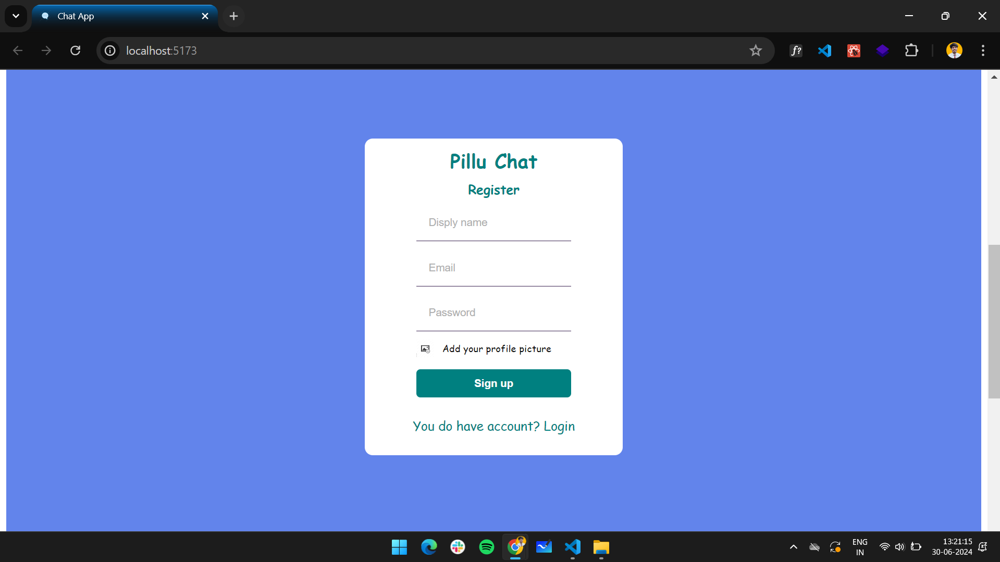
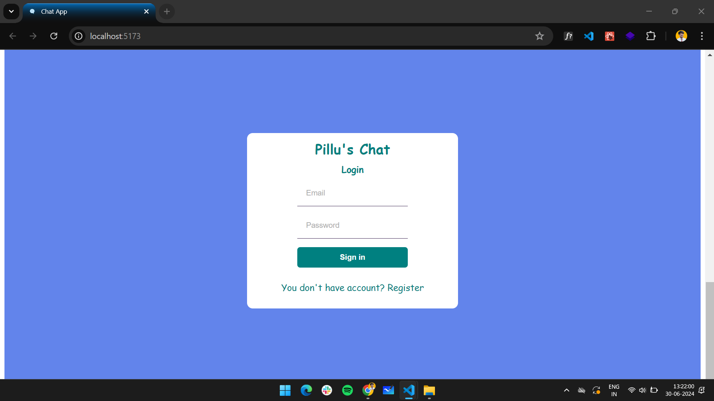
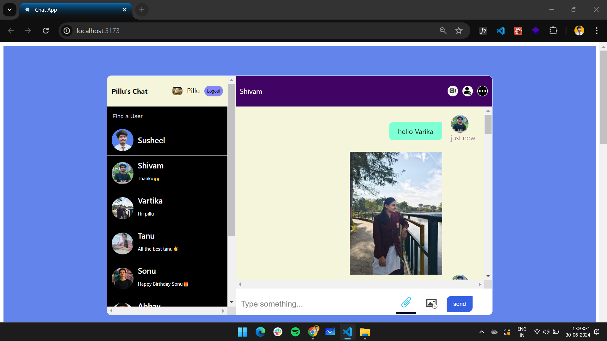

># Pillu Chat App 

## Introduction
Outline the development steps for creating a chat application using React, incorporating user authentication with Firebase, routing with React Router, and managing application state using Context API.

## Development Steps

### 1. Registration Page
- Create a registration form for users to sign up.
- Collect necessary user information like email and password.
- Implement form validation to ensure data integrity.
- Connect the form to Firebase Authentication for user registration.

### 2. Login Page
- Design a login form for existing users to log in.
- Implement authentication logic to verify user credentials.
- Connect the login form to Firebase Authentication for user login.

### 3. Home Page
- Set up a home page where users are redirected after successful authentication.
- Divide the home page into two sections: sidebar and chat section.

### 4. Sidebar
- Design a sidebar to display user information and navigation options.
- Include options for profile settings, contacts, groups, etc.
- Implement responsive design to accommodate different screen sizes.

### 5. Chat Section
- Create a chat section for users to communicate with each other.
- Include features like sending/receiving messages, emoji support, etc.
- Use Firebase Firestore for real-time data synchronization between users.

### 6. Full Sidebar and Chat Section
- Enhance the sidebar and chat section with additional functionality.
- Implement features like search, notifications, file sharing, etc.
- Ensure smooth integration between sidebar and chat components.

- Website: [Chat App](https://chat-app-five-rouge.vercel.app/)
- Github: [Github Repo](https://github.com/susheelvishwa/Chat-app/tree/main/Chat%20app)

### 7. Responsive Design
- Make the entire application responsive to work seamlessly across devices.
- Utilize CSS media queries and responsive design principles.
- Test the application on various devices and screen sizes to ensure compatibility.

### 8. Firebase Authentication
- Integrate Firebase Authentication for user registration and login.
- Handle authentication state changes within the application.
- Secure routes to restrict access to authenticated users only.

### 9. React Router
- Set up React Router for client-side routing within the application.
- Define routes for different pages like registration, login, and home.
- Ensure proper navigation between pages without full-page reloads.

### 10. Context API
- Implement Context API for managing application-wide state.
- Use context providers to share data and functions across components.
- Centralize state management to improve scalability and maintainability.

## Conclusion
By following these development steps, we can create a feature-rich chat application using React, Firebase, React Router, and Context API. This roadmap provides a structured approach to building each component of the application while ensuring scalability, responsiveness, and security.
